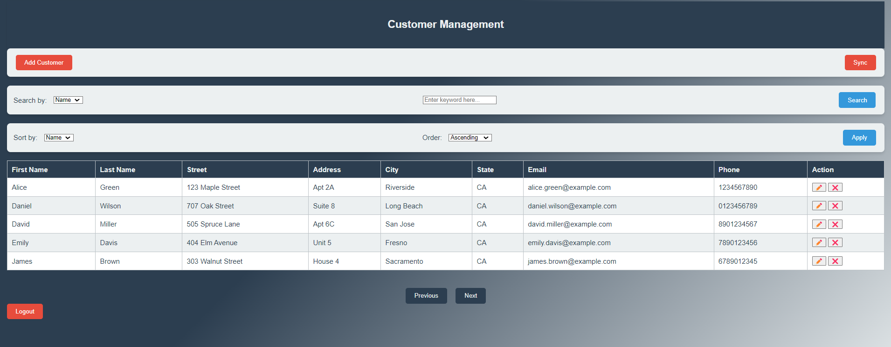

# Customer Management System

## Project Overview
This is a customer management system with a Spring Boot backend and an HTML/CSS/JavaScript frontend. It allows adding, updating, deleting, and listing customers, featuring pagination, sorting, and searching. The application includes JWT-based authentication and supports customer data synchronization from a remote API for seamless updates.

## Features
1. **Authentication**:
    - Secure login using JWT tokens.
    - Token validation for accessing customer operations.

2. **Customer Management**:
    - Create, update, delete, and view customer details.
    - Pagination, sorting, and searching customers.

3. **Synchronization**:
    - Sync customers with a remote API.
    - Update existing records or insert new customers if not present in the database.

## Technologies Used
- **Backend**: Spring Boot, Spring Security (JWT Authentication), JPA (Hibernate), MySQL.
- **Frontend**: HTML, CSS, JavaScript.
- **Tools**: Swagger for API documentation.

## Project Structure
- **Backend**: Located under `CustomerCRUD` directory.
- **Frontend**: Located under `FrontEnd/Auth` and `FrontEnd/Customers` directories.

## API Endpoints

### Authentication:
- **Login**: `POST /auth/login`
    - Accepts: `{ "username": "your_username", "password": "your_password" }`
    - Returns: JWT Token

### Customer Management:
- **List Customers**: `GET /customers?page={page}&size={size}&sort={field}&search={query}`
    - Returns: List of customers with pagination, sorting, and optional search.

- **Create Customer**: `POST /customers`
    - Body: Customer object (first name, last name, address, etc.)

- **Update Customer**: `PUT /customers/{id}`
    - Body: Updated customer details.

- **Delete Customer**: `DELETE /customers/{id}`

### Sync:
- **Sync Customers**: `POST /customers/sync`
    - Fetches data from the remote API and synchronizes it with the local database.

## Database Schema
The database consists of the following tables:
1. **Customers**:
    - `id` (Primary Key)
    - `first_name`, `last_name`, `email`, `phone`, `address`, `city`, `state`, `uuid`

2. **Admin** (for authentication):
    - `uuid` (Primary Key)
    - `login_id` (Unique), `password`, `roles` (Admin)


## Screenshots
### Login Page


### Customer List


### Add Customer


## Swagger Documentation
The API is documented with Swagger for easy testing and understanding.


## Setup Instructions

### Backend Setup
1. Clone the repository.
2. Create a MySQL database called `customer_management`.
3. Update the database credentials in `application.properties`.
4. Run the Spring Boot application using:
   ```
   ./mvnw spring-boot:run
   ```
5. The backend will be running on `http://localhost:8080`.

### Frontend Setup
1. Navigate to the `FrontEnd` folder.
2. Open `index.html` for the login page and `customers.html` for customer management.

### Running the Application
1. Start the backend server.
2. Open the frontend HTML pages in your browser.
3. Register an admin account through the registration page.
4. Log in with the registered admin credentials.
5. Use the customer list and sync features as needed.